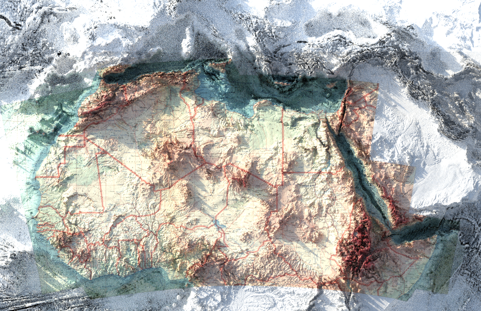

# 3D Vintage Topo Maps (3d-vtm)

## Overview

This project focuses on creating a 3D visualization of vintage topographic maps using R. The goal is to blend historical cartographic data with modern rendering techniques to create aesthetically pleasing and insightful 3D maps.

The specific example for this project visualizes North Africa, using vintage topo maps combined with digital elevation data.

---

## Output

### Final Visualization

The above image showcases a rendered 3D map of North Africa, highlighting the region's terrain with vintage map styling.

---

## Credits

- **Tutorial**: This project is inspired by Milos Popovic's excellent tutorial, [How to Make Amazing 3D Vintage Topo Maps](https://www.youtube.com/watch?v=0HFEQU-ELKk&list=PLHJLTurOfpLk2t74bIfjlqfBrN57zqd5A&index=5&ab_channel=MilosMakesMaps).
- **Tools and Techniques**: The visualization leverages R and the `rayshader` package, along with additional tools for processing elevation and raster data.

---

## Repository Structure

- `3d-vtm.R`: The R script used to generate the visualization.
- `3d_topo_north_africa.png`: The final rendered output.
- Additional files: Include any supporting configurations or settings.

---

## Notes

The full methodology is documented within the R script. Feel free to explore the code to understand the step-by-step process for creating 3D vintage topo maps.
